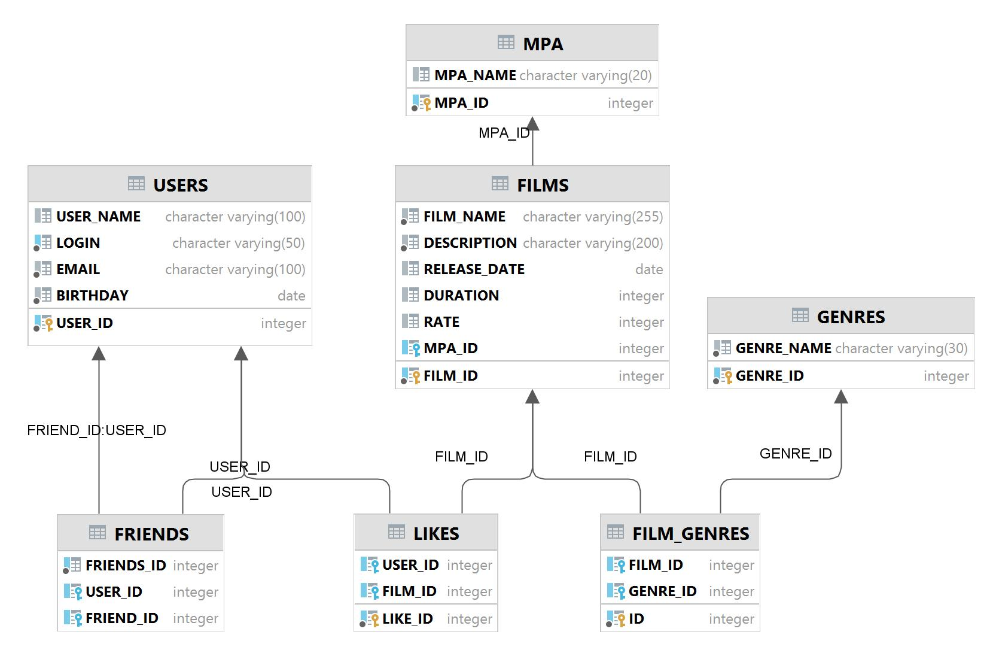

# java-filmorate
Template repository for Filmorate project.

Queries for basic operations:
1. films
   - getAll()
     - SELECT * FROM films AS f LEFT JOIN mpa AS m ON f.film_id = m.film_id;     
   - getById(filmId)
     - SELECT * FROM films AS f LEFT JOIN mpa AS m ON f.film_id = m.film_id WHERE f.film_id = filmId;     
3. users
   - getAll()
     - SELECT * FROM users;     
   - getById(userId)
     - SELECT * FROM users WHERE user_id = userId;   
4. likes
   - getById(filmId)
     - SELECT * FROM films AS f 
       LEFT JOIN likes AS l ON f.film_id = l.film_id
       LEFT JOIN users AS u ON l.user_id = u.user_id 
       WHERE l.film_id = filmId;
5. friends
   - getAll(userId)
     - SELECT * FROM  users AS u LEFT JOIN friends AS f ON u.user_id = f.user_id WHERE u.user_id = userId;
   - getCommonFriends(userId, otherId)
     - SELECT * FROM friends AS f LEFT JOIN users AS u ON f.user_id = u.user_id WHERE f.user_id = userId AND f.user_id = otherId;
6. film_genres
   - getById(filmId)
     - SELECT * FROM films AS f 
       LEFT JOIN film_genres AS fg ON f.film_id = fg.film_id 
       LEFT JOIN genres AS g ON fg.genre_id = g.genre_id;     
